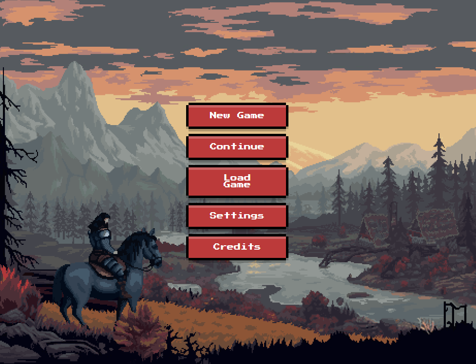
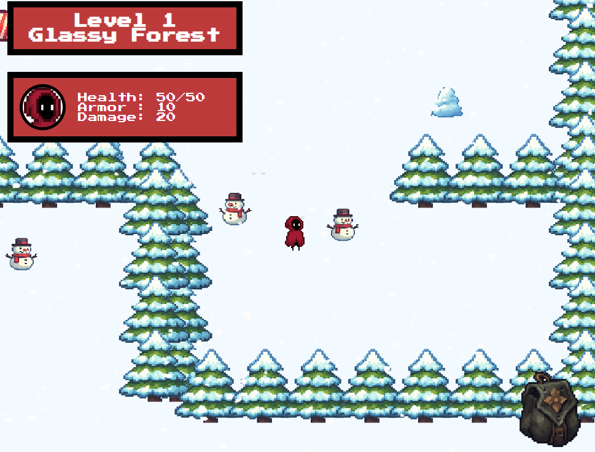
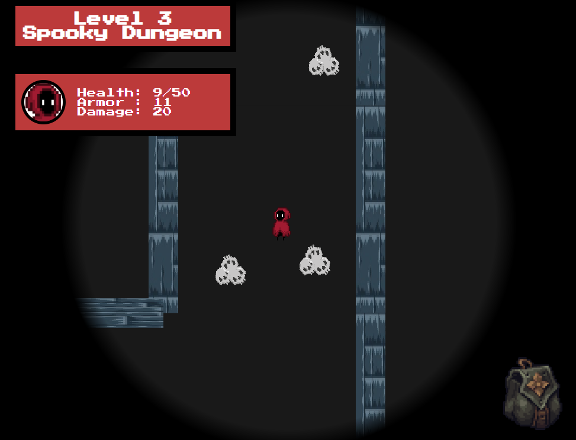
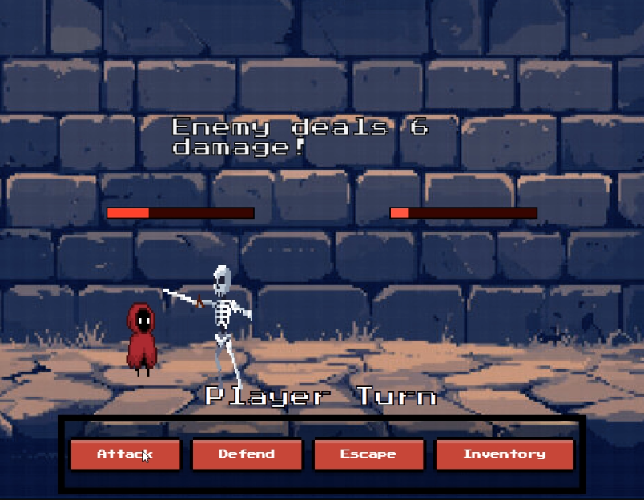
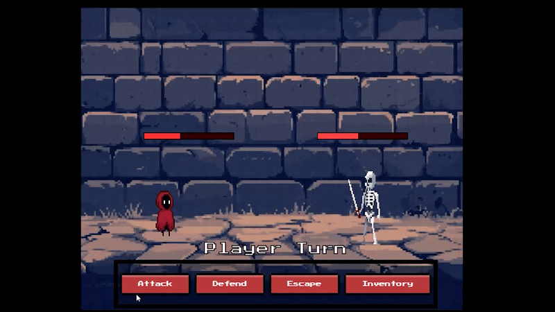

# **MazeRunnerGame**
### **Author:** Dmytro Savchuk (IPZk-24-1)
### Project for the university disciplines:
### "Component-oriented programming" and "Software standardization and documentation"

---

## **Features**

### **Procedural Maze Generation**
- Each level is generated randomly
- Unique maze layouts every time
- Algorithmic patterns for varying difficulty

### **Turn-Based Combat**
- Tactical turn-based battles with different enemy types
- Strategic decision-making
- Character stats and inventory system

### **RPG Elements**
- Character attributes
- Character upgrades
- Item collection

---

## **Preview Images**

  
  
  
  


---

## **Installation & Running**

You can run the game in two ways:

---

### **Option 1 – Desktop Version**

Download the prebuilt version:

👉 **[Download MazeRunnerGame](https://github.com/DmytroSav4uk/MazeRunnerGame/releases/tag/maze)**

Unzip the archive and run:

```
MazeRunnerGame.exe
```

The game will start as a desktop application.

---

### **Option 2 – Run in Browser**

### **1. Clone the repository**

```bash
git clone https://github.com/DmytroSav4uk/MazeRunnerGame.git
cd MazeRunnerGame
```

### **2. Install dependencies (npm and node must be installed beforehand)**

```bash
npm install
```

### **3. Run the project**

```bash
ng serve
node server.js
```

Open in browser:

```
http://localhost:4200
```

---

## **Configuration**

Basic project configuration is handled via standard Angular files:

- `angular.json` – project configuration
- `package.json` – dependencies & scripts
- `tsconfig.json` – TypeScript configuration

---

## **Tech Stack**

- **Front-end:** Angular 20
- **Back-end:** Node.js
- **Languages:** TypeScript and Javascript
- **Architecture:** Component-based design

---

## **License**

This project is licensed under the MIT License.

See the full license text here:

👉 [license.txt](license.txt)

---

## **Privacy**
This project is privacy-focused and does not collect any personal data. You can read the full [Privacy Policy here](PRIVACY.md).
